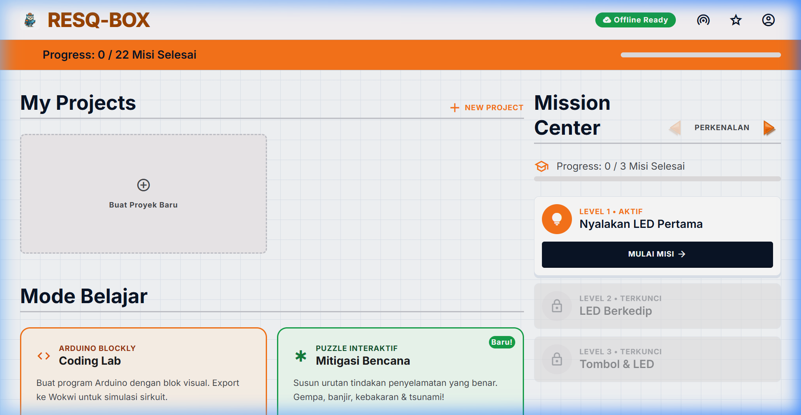
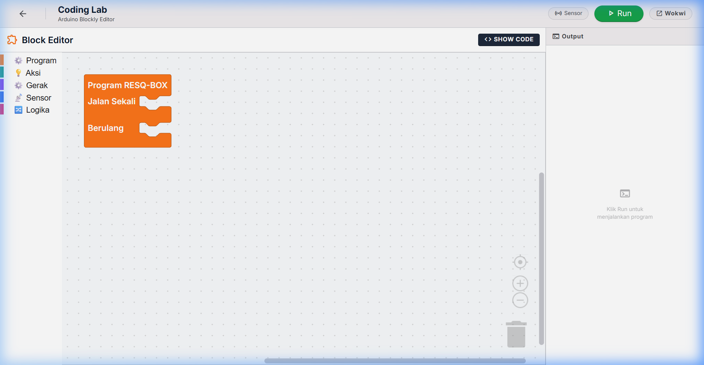
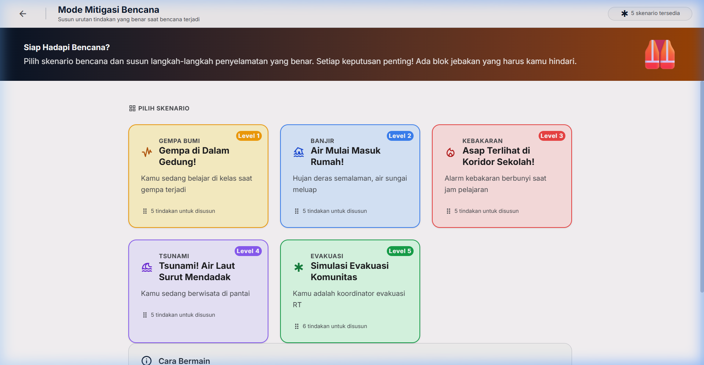

# LAPORAN PROYEK PENGEMBANGAN APLIKASI
## **RESQ-BOX: Platform Edukasi Interaktif Simulasi & Pemrograman Arduino untuk Mitigasi Bencana**

---

### **1. Latar Belakang**

Indonesia secara geografis terletak di wilayah *Ring of Fire* (Cincin Api Pasifik) dan pertemuan tiga lempeng tektonik utama dunia, yang menjadikannya sangat rentan terhadap berbagai bencana alam seperti gempa bumi, letusan gunung berapi, tsunami, serta bencana hidrometeorologi seperti banjir. Kurangnya edukasi kesiapsiagaan bencana sejak usia dini di kalangan siswa dan remaja sering kali memperburuk dampak bencana tersebut karena ketidaktahuan tindakan penyelamatan diri yang tepat.

Di sisi lain, perkembangan dunia pendidikan global menuntut integrasi pembelajaran berbasis **STEM** (*Science, Technology, Engineering, and Mathematics*). Namun, pembelajaran pemrograman mikrokontroler (seperti Arduino) di sekolah sering kali dianggap rumit, membosankan, dan abstrak bagi pemula karena kendala sintaksis kode (*syntax error*) serta minimnya korelasi dengan aplikasi pemecahan masalah di dunia nyata.

Oleh karena itu, dikembangkanlah **RESQ-BOX**, sebuah platform edukasi inovatif yang menggabungkan pembelajaran logika pemrograman Arduino menggunakan blok visual dengan skenario mitigasi bencana secara interaktif. Aplikasi ini hadir sebagai solusi untuk menjembatani pendidikan teknologi dan kesiapsiagaan bencana secara lebih menyenangkan, aplikatif, dan mudah diakses.

---

### **2. Tujuan Pengembangan**

Pengembangan platform **RESQ-BOX** memiliki tujuan sebagai berikut:
1. **Mempermudah Pembelajaran Pemrograman**: Menyediakan platform pemrograman visual berbasis blok (*Blockly*) agar siswa dapat fokus memahami logika dan algoritma pemrograman Arduino tanpa kendala sintaksis kode.
2. **Mengintegrasikan Teknologi dengan Edukasi Bencana**: Menghubungkan pemahaman fungsi komponen sensor elektronik (sensor air, getaran, suhu) dengan respon keselamatan mitigasi bencana secara real-time.
3. **Meningkatkan Kesiapsiagaan Sejak Dini**: Menyediakan skenario simulasi kebencanaan yang interaktif dan menyenangkan untuk melatih intuisi tanggap darurat anak-anak.
4. **Mendukung Pembelajaran Inklusif & Luring**: Mengembangkan media ajar yang ringan, efisien, dan dapat dijalankan tanpa jaringan internet (*offline ready*) guna mendukung sekolah-sekolah di wilayah rawan bencana dengan infrastruktur terbatas.

---

### **3. Manfaat Media**

Media edukasi **RESQ-BOX** diharapkan mampu memberikan manfaat luas bagi berbagai pihak:

#### **A. Bagi Siswa / Peserta Didik**
* **Mengasah Berpikir Komputasional**: Melatih kemampuan *computational thinking* dan pemecahan masalah melalui penyusunan blok kode yang terstruktur.
* **Meningkatkan Pemahaman Tanggap Darurat**: Memberikan pemahaman praktis mengenai urutan tindakan penyelamatan diri yang tepat melalui skenario *Interactive Puzzle*.
* **Meningkatkan Minat STEM**: Menyajikan visualisasi yang menarik, reaktif, dan interaktif guna menumbuhkan ketertarikan siswa pada dunia robotika dan IoT.

#### **B. Bagi Guru / Pendidik**
* **Alat Bantu Ajar yang Praktis**: Memudahkan guru dalam mengajarkan pemrograman Arduino secara demonstratif tanpa perlu menyiapkan hardware fisik yang rumit pada tahap awal.
* **Sistem Evaluasi Otomatis**: Membantu guru melacak dan mengevaluasi pemahaman logika siswa secara otomatis melalui sistem validasi misi.

#### **C. Bagi Sekolah & Masyarakat**
* **Sosialisasi Kebencanaan Mandiri**: Menjadi media sosialisasi kebencanaan yang interaktif, murah, dan berkelanjutan bagi institusi pendidikan.
* **Efisiensi Anggaran Laboratorium**: Meminimalisir ketergantungan pada hardware fisik yang mahal melalui integrasi simulasi visual dan ekspor kode ke simulator eksternal (Wokwi).

---

### **4. Deskripsi Proyek**

**RESQ-BOX** adalah platform pembelajaran berbasis web interaktif yang dirancang untuk mengedukasi anak-anak, siswa, dan pemula mengenai dasar-dasar pemrograman Arduino (menggunakan antarmuka blok visual) yang dipadukan secara tematik dengan konsep mitigasi bencana alam. 

Dengan menyajikan tantangan yang relevan dengan kehidupan sehari-hari (seperti banjir, gempa bumi, dan gunung meletus), aplikasi ini bertujuan membangun ketahanan kesiapsiagaan bencana sekaligus melatih keterampilan pemecahan masalah teknis dan pemrograman logis.

#### **Kegunaan Utama**
* **Media Pembelajaran STEM/STEM-D**: Memfasilitasi guru dan siswa dalam memahami pemrograman mikrokontroler (Arduino) secara praktis dan intuitif tanpa terhambat penulisan sintaksis kode (*syntax error*).
* **Edukasi Kesiapsiagaan Bencana**: Meningkatkan kesadaran dini (*early warning awareness*) masyarakat, khususnya anak-anak, melalui simulasi skenario bencana alam.
* **Simulator Logika Mandiri**: Memberikan kebebasan berkreasi melalui laboratorium pemrograman terbuka (*Coding Lab*).

##### **Fitur-Fitur Utama**

Media pembelajaran interaktif RESQ-BOX yang dikembangkan memiliki beberapa fitur utama yang mendukung proses pembelajaran. Setiap fitur dirancang untuk membantu pengguna memahami materi dan logika pemrograman secara lebih mudah dan menarik.

* **Dashboard (Halaman Utama)**: Merupakan halaman utama yang pertama kali ditampilkan saat pengguna mengakses website. Halaman ini berisi informasi singkat mengenai media pembelajaran RESQ-BOX, status progres misi global, akses cepat ke proyek pengguna (*My Projects*), dan navigasi ke berbagai mode belajar lainnya. Dashboard dirancang dengan tampilan yang interaktif dan visual yang menarik untuk memberikan pengalaman awal yang baik bagi pengguna.
* **Coding Lab (Arduino Blockly)**: Merupakan fitur utama yang digunakan untuk menyusun program Arduino secara visual berbasis blok (*Blockly*). Fitur ini menyajikan kanvas drag-and-drop dengan blok-blok khusus (seperti LED, Buzzer, Motor, Servo, Sensor) yang dirancang untuk mempermudah pemula dalam menyusun kode pemrograman C++ tanpa perlu khawatir terhadap kendala penulisan sintaksis (*syntax error*).
* **Mission Center (Pusat Misi Pembelajaran)**: Merupakan fitur penyajian materi dan tantangan logika secara terstruktur yang terdiri dari 22 level misi kebencanaan (Perkenalan, Gempa Bumi, Banjir, Gunung Meletus, dan Ujian). Setiap misi menyajikan skenario kasus nyata kebencanaan di Indonesia, panduan langkah demi langkah, tips instruksional, serta fitur **Validasi Misi** otomatis untuk mengecek ketepatan logika program yang disusun oleh pengguna.
* **Puzzle Mitigasi Interaktif**: Merupakan fitur non-coding berbasis penyusunan urutan tindakan penyelamatan darurat (seperti Gempa Bumi, Banjir, Kebakaran, Tsunami, dan Evakuasi Komunitas). Pengguna diminta untuk mengurutkan langkah evakuasi yang benar secara *drag-and-drop*, yang dilengkapi dengan penjelasan teoritis yang mendalam untuk meningkatkan kesiapsiagaan bencana di kehidupan nyata.
* **Progress Tracker & Offline Ready**: Fitur ini berfungsi untuk merekam riwayat penyelesaian misi pengguna secara persisten menggunakan *state management* lokal. Selain itu, fitur ini mendukung kemampuan *Progressive Web App* (PWA) sehingga media pembelajaran ini siap digunakan sepenuhnya secara luring (*offline*) setelah pemuatan pertama, memastikan kegunaannya di daerah rawan bencana dengan koneksi internet terbatas.

---

### **5. Software yang Digunakan**

Proses pengembangan dan pembuatan media pembelajaran interaktif RESQ-BOX melibatkan penggunaan beberapa perangkat lunak (software) utama untuk mendukung efisiensi kerja tim:

* **Visual Studio Code (VS Code)**: Digunakan sebagai perangkat lunak utama dalam proses pengembangan website. VS Code berfungsi sebagai code editor untuk menulis, mengedit, dan mengelola kode program yang digunakan dalam pembuatan media pembelajaran. Melalui software ini, proses pengembangan website menjadi lebih mudah karena menyediakan berbagai fitur pendukung seperti *syntax highlighting*, *auto-completion*, *debugging*, serta integrasi dengan berbagai ekstensi yang membantu produktivitas pengembang.
* **Figma**: Digunakan sebagai alat perancangan antarmuka (UI/UX) sebelum proses implementasi website dilakukan. Software ini membantu tim dalam membuat desain tampilan, menentukan tata letak komponen, memilih kombinasi warna, serta merancang alur navigasi pengguna. Dengan adanya desain yang dibuat menggunakan Figma, proses pengembangan website dapat berjalan lebih terarah dan sesuai dengan konsep yang telah direncanakan.
* **Git & GitHub**: Git digunakan sebagai sistem pengontrol versi (*version control system*) untuk melacak setiap perubahan pada kode program selama proses pengembangan. Sedangkan GitHub digunakan sebagai platform repositori daring (*cloud hosting*) untuk menyimpan kode program, berkolaborasi antarpengembang dalam tim secara terstruktur, serta mengintegrasikan sistem dengan layanan deployment.
* **Google Chrome & DevTools**: Google Chrome digunakan sebagai web browser utama untuk menguji fungsionalitas dan tampilan responsif website secara langsung. Dengan memanfaatkan alat bantu pengembang (*Chrome DevTools*), tim dapat melakukan analisis performa halaman, debugging kode Javascript/TypeScript, serta menginspeksi elemen CSS secara real-time.

---

### **6. Teknologi & Library yang Digunakan**

Aplikasi RESQ-BOX dibangun menggunakan arsitektur modern berbasis komponen web berkinerja tinggi:

* **Framework Utama**: [React 19](https://react.dev/) – Untuk pengelolaan antarmuka berbasis komponen yang reaktif dan dinamis.
* **Bahasa Pemrograman**: [TypeScript](https://www.typescriptlang.org/) – Menjamin keamanan tipe data dan meminimalisir bug selama pengembangan.
* **Build Tool & Dev Server**: [Vite 8](https://vite.dev/) – Untuk proses build bundel produksi yang cepat dan pengembangan lokal yang efisien.
* **Desain UI & Styling**: [Tailwind CSS 4](https://tailwindcss.com/) – Untuk penyusunan tata letak responsif, modern, dan bernuansa premium.
* **State Management**: [Zustand 5](https://github.com/pmndrs/zustand) – Pengelola state aplikasi yang ringan untuk melacak progress misi dan draft workspace.
* **Library Spesifik**:
  * **Blockly (Google)**: Mesin utama pembuatan blok visual pemrograman Arduino.
  * **React Router Dom (v7)**: Mengatur navigasi antar-halaman (Dashboard, Workspace, Mitigasi).
  * **@dnd-kit (Core & Sortable)**: Menyusun interaksi drag-and-drop yang responsif dan lancar pada mode Puzzle Mitigasi.
  * **Lucide React & Material Symbols**: Pustaka ikon visual modern.
  * **Vite Plugin PWA**: Menyediakan service worker untuk kemampuan offline aplikasi.

---

### **7. Tampilan Media**

* **Dashboard**

Dashboard merupakan halaman utama yang pertama kali ditampilkan saat pengguna mengakses website RESQ-BOX. Dashboard menampilkan informasi singkat mengenai media pembelajaran, progres penyelesaian misi global secara keseluruhan, daftar proyek pemrograman kustom (*My Projects*), dan navigasi ke mode belajar interaktif (seperti *Coding Lab* dan *Puzzle Mitigasi*), serta panel *Mission Center*. Halaman ini membantu pengguna memahami fungsionalitas dan navigasi website sebelum memulai aktivitas pemrograman atau latihan kesiapsiagaan bencana.

* **Coding Lab (Workspace Pemrograman)**

Coding Lab merupakan halaman utama bagi pengguna untuk menyusun blok visual pemrograman Arduino. Halaman ini memiliki area kerja editor blok di sisi kiri dan panel output simulasi atau visualisasi kode C++ Arduino di sisi kanan. Melalui halaman ini, pengguna dapat secara interaktif merancang kode pemrograman dan melihat konversi sintaksis secara langsung.

* **Mode Mitigasi Bencana (Puzzle Evakuasi)**

Halaman Mode Mitigasi Bencana menyajikan daftar level skenario mitigasi berupa puzzle interaktif drag-and-drop. Pengguna dapat memilih skenario bencana alam (seperti Gempa Bumi, Banjir, Kebakaran, Tsunami, dan Evakuasi Komunitas) dan diarahkan ke tantangan penyusunan langkah-langkah evakuasi mandiri yang logis dan aman.

---

### **8. URL Proyek & Repositori**

* **Repositori GitHub**: [https://github.com/RaffaelVeneh/RESQ-BOX.git](https://github.com/RaffaelVeneh/RESQ-BOX.git)
* **Akses Pengembangan Lokal**: `http://localhost:5173/`

---

### **9. Anggota Kelompok dan Pembagian Tugas**

Pengembangan media pembelajaran interaktif berbasis web pada materi simulasi dan pemrograman Arduino (RESQ-BOX) dilakukan secara berkelompok dengan pembagian tugas yang disesuaikan berdasarkan kemampuan dan kontribusi masing-masing anggota. Pembagian tugas ini bertujuan agar proses pengembangan dapat berjalan secara efektif dan terstruktur.

| No. | Nama | Tugas |
| :--- | :--- | :--- |
| 1. | **Muhammad Zidane Romadhona Haryanto** | Bertanggung jawab dalam pengembangan antarmuka pengguna (*frontend*), tata letak halaman, implementasi komponen visual, serta pengujian interaktivitas aplikasi. |
| 2. | **Raffael Vincent Nathaniel Handoko** | Bertanggung jawab dalam pengembangan logika sistem dan pemrosesan data (*backend*), integrasi pustaka Blockly Google, pengelolaan *state*, serta arsitektur internal aplikasi. |
| 3. | **Zahra Rokhadatul Aisy Ramadhani** | Bertanggung jawab dalam penyusunan konsep edukasi kebencanaan, penyusunan narasi misi pembelajaran, perancangan antarmuka pengguna (UI/UX), serta penyusunan laporan proyek. |
| 4. | **Lintang Pansavia Lysandra** | Bertanggung jawab dalam manajemen proyek, penyusunan skenario puzzle mitigasi bencana, penyusunan teks edukasi keselamatan, serta penyusunan dokumentasi proyek. |
| 5. | **Rizki Arumning Tyas, M.Pd.** | Dosen/Guru Pembimbing yang bertanggung jawab dalam memberikan arahan akademis, meninjau relevansi materi pembelajaran, dan membimbing jalannya proyek. |

---

### **10. Penutup**

#### **10.1 Kesimpulan**

Media pembelajaran interaktif berbasis web **RESQ-BOX: Simulasi & Pemrograman Arduino untuk Mitigasi Bencana** telah berhasil dikembangkan sebagai sarana pendukung pembelajaran STEM yang dapat diakses melalui browser. Media ini menyediakan berbagai fitur utama, seperti Dashboard, Coding Lab (Blockly), Mission Center terstruktur (22 level misi), Puzzle Mitigasi Interaktif, serta dukungan akses PWA offline yang dirancang untuk membantu pengguna memahami konsep dasar logika pemrograman mikrokontroler Arduino serta kesiapsiagaan bencana alam secara lebih mudah, menarik, dan aplikatif.

Melalui penyajian skenario mitigasi bencana yang relevan dengan kehidupan nyata serta adanya fitur umpan balik dan validasi kode otomatis, media pembelajaran ini diharapkan dapat meningkatkan minat siswa pada teknologi STEM sekaligus melatih kepedulian tanggap darurat bencana sejak usia dini. Selain itu, pemanfaatan teknologi berbasis web (PWA) memberikan kemudahan akses yang inklusif sehingga proses pembelajaran dapat dilakukan secara fleksibel dan efisien di mana saja, bahkan di wilayah dengan keterbatasan koneksi internet.
